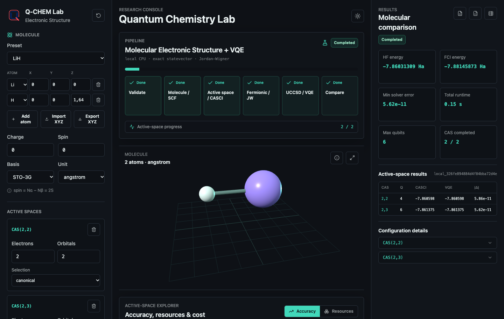
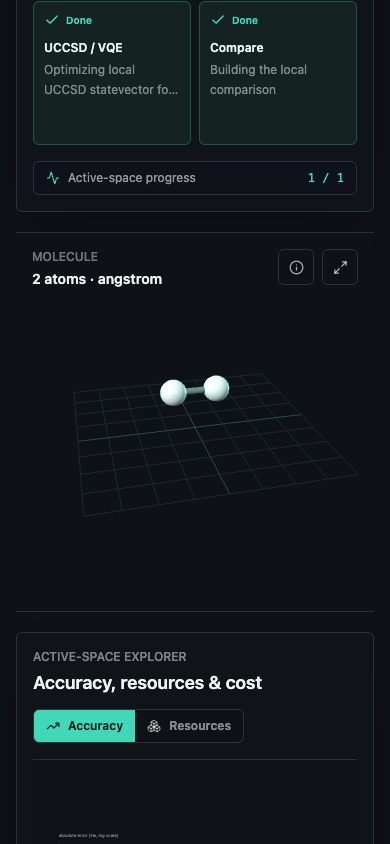
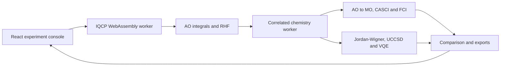
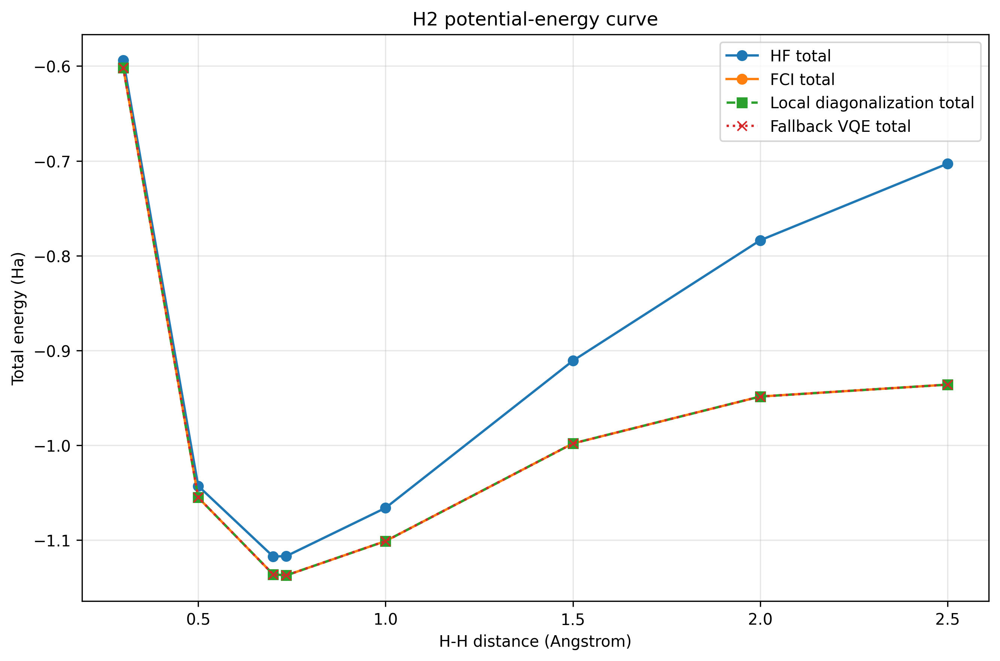

# Q-CHEM Lab

<p align="center">
  
</p>

<p align="center">
  <strong>Browser-native quantum chemistry for transparent active-space and VQE experiments.</strong><br />
  A reproducible bridge from small molecular benchmarks to controlled
  Atomic Layer Deposition (ALD) research models.
</p>

<p align="center">
  <a href="https://karimelhoudaigui.github.io/quantum-ald-simulation/"></a>
  <a href="https://github.com/karimelhoudaigui/quantum-ald-simulation/actions/workflows/qchem-pages.yml"></a>
  
  
  
</p>

> **Try the live platform:**
> [karimelhoudaigui.github.io/quantum-ald-simulation](https://karimelhoudaigui.github.io/quantum-ald-simulation/)
>
> No installation or account is required. After the static application and its
> WebAssembly module have loaded, the scientific calculation runs on the
> visitor's computer or phone. Molecular coordinates are not sent to a remote
> compute API.

<p align="center">
  <a href="https://karimelhoudaigui.github.io/quantum-ald-simulation/">
    
  </a>
</p>

## Contents

- [Why this project exists](#why-this-project-exists)
- [What the platform does](#what-the-platform-does)
- [How to run an experiment](#how-to-run-an-experiment)
- [Scientific model](#scientific-model)
- [Browser architecture and privacy](#browser-architecture-and-privacy)
- [Validated examples](#validated-examples)
- [Scope and limitations](#scope-and-limitations)
- [Installation](#installation)
- [Reproducing the research results](#reproducible-heavy-validation)
- [Roadmap](#natural-roadmap)

## Why this project exists

Electronic-structure workflows are powerful, but they are difficult to inspect
end to end. A newcomer often has to assemble a chemistry package, integral
conventions, active-space choices, a fermion-to-qubit mapper, an ansatz, an
optimizer and a simulator before seeing a first trustworthy result. Even when
the calculation succeeds, three very different approximations can be hidden
behind one reported number:

1. the molecular basis-set approximation;
2. the truncation to a chosen active orbital space;
3. the error of the variational solver inside that active space.

Q-CHEM Lab makes those layers visible. It lets a user edit a molecule, compare
active spaces, inspect qubit and Pauli costs, and separate solver error from
active-space error in one interface. The browser application is deliberately
small enough to audit and runs locally enough to be useful in a classroom, on a
laptop, or from a phone without provisioning a chemistry server.

The longer-term scientific motivation is **Atomic Layer Deposition**. ALD is a
thin-film manufacturing process driven by sequences of surface reactions.
Bond breaking, bond formation, charge transfer and near-degenerate electronic
states can make selected reaction fragments challenging for approximate
classical methods. Before claiming anything about realistic surfaces, this
repository builds and validates every layer on H2, LiH and H2O, then progresses
toward controlled ALD-inspired fragments and modest active spaces.

This is a research and education platform. It does **not** claim quantum
advantage, replace production electronic-structure software, or currently run
the public workflow on quantum hardware.

## What the platform does

The hosted Q-CHEM Lab currently provides:

- H2, LiH and H2O presets, plus custom geometries and XYZ import/export;
- editable atoms, coordinates, units, charge, spin and basis;
- STO-3G and 6-31G basis selection;
- RHF, CASCI, full-space FCI when feasible, and exact-statevector VQE;
- configurable `CAS(n electrons, m orbitals)` comparisons;
- Jordan-Wigner mapping and UCCSD trial states;
- a 3D molecule view with orbit, zoom and two-finger trackpad panning;
- live pipeline progress and structured scientific errors;
- separate solver, active-space and total errors;
- qubit, Pauli-term, parameter, circuit and optimizer resource estimates;
- request JSON, result JSON and comparison CSV export.

The `RUN HARDWARE` control is intentionally reserved for the future QPU
connector. It is visible so the execution model has a stable place in the
interface, but it is disabled until credentials, provider selection, job
persistence and hardware result provenance are implemented.

## How to run an experiment

1. **Open the app.** Visit the [live Q-CHEM Lab](https://karimelhoudaigui.github.io/quantum-ald-simulation/).
2. **Define the molecule.** Choose H2, LiH or H2O, edit the table, or import an XYZ file. Coordinates may use angstrom or bohr.
3. **Check charge and spin.** The browser engine currently accepts neutral, closed-shell singlets, so use `charge = 0` and `spin = 0` with an even electron count.
4. **Choose the basis.** Start with STO-3G. 6-31G is available, but larger orbital spaces increase FCI and statevector cost quickly.
5. **Configure active spaces.** `CAS(2,2)` means two active electrons distributed over two spatial orbitals. Add another row to compare accuracy with resource growth.
6. **Select methods.** HF gives the mean-field reference; CASCI is the exact reference inside each active space; FCI is the finite-basis full-space reference when feasible; VQE optimizes UCCSD inside each active space.
7. **Run locally.** Select `Exact statevector`, then press `RUN EXPERIMENT`. The pipeline reports SCF, active-space, mapping and VQE progress.
8. **Read the comparison.** Compare CASCI with VQE to diagnose the solver, and compare CASCI with FCI to diagnose the active-space truncation.
9. **Export the evidence.** Use the result-panel icons to download the normalized request, complete result, or flat CSV table.

Runtime depends on the visitor's CPU and on the requested basis and active
spaces. Closing or refreshing the page stops the in-memory experiment; there
is no remote job queue.

<table>
  <tr>
    <td width="68%">
      
      <br /><sub>Desktop: LiH with CAS(2,2) and CAS(2,3), local UCCSD/VQE and separated errors.</sub>
    </td>
    <td width="32%">
      
      <br /><sub>Mobile: completed H2 experiment with the full molecule and interaction plane in frame.</sub>
    </td>
  </tr>
</table>

## Scientific model

### Quick glossary

| Term | Meaning in Q-CHEM Lab |
|---|---|
| HF / RHF | Mean-field reference built from one closed-shell Slater determinant |
| FCI | Exact diagonalization for all electrons and orbitals in the selected finite basis |
| CAS(n,m) | Complete active space with `n` active electrons in `m` spatial orbitals |
| CASCI | Exact diagonalization inside one CAS while the molecular orbitals stay fixed |
| Jordan-Wigner | Transformation from fermionic creation/annihilation operators to qubit Pauli operators |
| UCCSD | Unitary coupled-cluster ansatz containing single and double excitations |
| VQE | Classical optimization of a parameterized quantum-state energy expectation value |

Energies are reported in Hartree (`Ha`), with `1 Ha` approximately equal to
`27.2 eV`. When geometry, basis and electron count are identical, a lower total
energy is variationally better. Energies from different molecular definitions
must not be ranked without accounting for their composition and conventions.

### Electronic Hamiltonian

Within the Born-Oppenheimer approximation and a finite spin-orbital basis, the
second-quantized molecular Hamiltonian used by the project is

$$
\hat H = E_{\mathrm{const}}
+ \sum_{pq} h_{pq} a_p^\dagger a_q
+ \frac{1}{2}\sum_{pqrs} g_{pqrs}
  a_p^\dagger a_q^\dagger a_s a_r .
$$

Here, $h_{pq}$ and $g_{pqrs}$ are one- and two-electron integrals. For a full
molecular problem, $E_{\mathrm{const}}$ contains the nuclear repulsion. For a
frozen-core active-space problem, it also contains the frozen-core electronic
contribution. The project uses one explicit total-energy convention:

$$
E_{\mathrm{total}} = E_{\mathrm{active}} + E_{\mathrm{const}}.
$$

Keeping the constant separate prevents a common error: adding nuclear
repulsion twice when reconstructing a CASCI or VQE total energy.

### HF, CASCI and FCI

Restricted Hartree-Fock (RHF) optimizes one closed-shell Slater determinant and
provides both a baseline energy and molecular orbitals. CASCI then diagonalizes
the Hamiltonian exactly inside a selected complete active space. If $M$ is the
number of active spatial orbitals, the fixed-spin determinant count is

$$
D_{\mathrm{CAS}} = {M \choose N_\alpha}{M \choose N_\beta}.
$$

FCI applies the same exact diagonalization principle to every orbital in the
chosen finite basis. It is exact **inside that basis**, not the exact solution
of the continuum molecular problem. Its combinatorial growth is why active
spaces are necessary.

### Jordan-Wigner mapping

Fermionic operators are converted to qubit operators with Jordan-Wigner. In
the project's interleaved alpha/beta spin-orbital ordering,

$$
a_p^\dagger = \frac{1}{2}(X_p - iY_p)
\prod_{j=0}^{p-1} Z_j,
\qquad
a_p = \frac{1}{2}(X_p + iY_p)
\prod_{j=0}^{p-1} Z_j.
$$

After mapping and collecting equal strings, the qubit Hamiltonian is

$$
\hat H_q = \sum_k c_k P_k,
\qquad P_k \in \{I,X,Y,Z\}^{\otimes n}.
$$

The interface reports the number of qubits and Pauli terms for each active
space so that improved chemistry can be compared with increased quantum cost.

### UCCSD and VQE

The variational state starts from the molecular Hartree-Fock determinant and
applies a unitary coupled-cluster singles-and-doubles operator:

$$
|\psi(\boldsymbol\theta)\rangle =
e^{T(\boldsymbol\theta)-T^\dagger(\boldsymbol\theta)}
|\Phi_{\mathrm{HF}}\rangle,
\qquad T = T_1 + T_2.
$$

VQE minimizes the Rayleigh quotient

$$
E_{\mathrm{VQE}} = \min_{\boldsymbol\theta}
\frac{\langle\psi(\boldsymbol\theta)|\hat H_q|
\psi(\boldsymbol\theta)\rangle}
{\langle\psi(\boldsymbol\theta)|\psi(\boldsymbol\theta)\rangle}
\ge E_0^{\mathrm{CAS}}.
$$

The hosted app evaluates this objective with an exact local statevector and a
deterministic periodic-coordinate optimizer. It therefore measures ansatz and
optimization quality without shot noise or hardware noise. The Python research
workflows later in this README add shot-based Aer execution, synthetic hardware
noise and mitigation as separate, explicitly labelled experiments.

### Error decomposition

One number is not enough to diagnose a quantum-chemistry workflow. Q-CHEM Lab
reports

$$
\Delta_{\mathrm{solver}} = E_{\mathrm{VQE}} - E_{\mathrm{CASCI}},
$$

$$
\Delta_{\mathrm{active}} = E_{\mathrm{CASCI}} - E_{\mathrm{FCI}},
$$

$$
\Delta_{\mathrm{total}} = E_{\mathrm{VQE}} - E_{\mathrm{FCI}}
= \Delta_{\mathrm{solver}} + \Delta_{\mathrm{active}}.
$$

All three comparisons use the same geometry, finite basis and total-energy
convention. The commonly used chemical-accuracy target is approximately
$1.6\times10^{-3}$ Hartree (1 kcal/mol). A tiny solver error does not imply a
chemically accurate molecular result when active-space or basis errors remain
larger.

## Browser architecture and privacy



- **UI thread:** React, Zustand and Three.js handle editing, visualization and result inspection.
- **Integral/SCF worker:** the vendored IQCP WebAssembly engine computes molecular integrals and RHF away from the UI thread.
- **Correlated worker:** TypeScript performs AO-to-MO transformation, frozen-core active-space construction, fixed-spin CASCI/FCI, Jordan-Wigner resource mapping and exact UCCSD statevector optimization.
- **Static hosting:** GitHub Pages serves HTML, JavaScript, the logo and WASM. There is no production chemistry API.
- **Data locality:** after assets load, coordinates and numerical results remain in the browser unless the user explicitly exports them.

The vendored IQCP revision, SHA-256 checksums and MIT notice are documented in
[`qchem-lab/public/wasm/README.md`](qchem-lab/public/wasm/README.md). The browser
engine and the optional Python/Qiskit validation stack are independent
implementations that share scientific conventions and benchmark targets.

## Validated examples

The following values are representative completed runs at the listed geometry
and basis. Last optimizer digits and wall-clock timings may vary by device.

| System | Geometry | Basis | Active space | Qubits | Pauli terms | HF total (Ha) | CASCI/VQE total (Ha) | Full FCI total (Ha) | Solver error |
|---|---|---|---:|---:|---:|---:|---:|---:|---:|
| H2 | 0.74 A | STO-3G | CAS(2,2) | 4 | 15 | -1.11675931 | -1.13728383 | -1.13728383 | < 1e-10 Ha |
| LiH | 1.64 A | STO-3G | CAS(2,2) | 4 | 27 | -7.86031309 | -7.86059755 | -7.88145873 | < 1e-10 Ha |
| LiH | 1.64 A | STO-3G | CAS(2,3) | 6 | 62 | -7.86031309 | -7.86137471 | -7.88145873 | < 1e-10 Ha |

For H2/STO-3G, CAS(2,2) is the full orbital space, so CASCI and FCI coincide.
For LiH, the VQE solver also reproduces each CASCI target, but the roughly
`0.020 Ha` gap to full FCI remains an active-space error. That distinction is a
central result of the platform, not a failure to hide.

Machine-readable validation artifacts and figures live under `results/`. The
sections below document how each reference was generated and which claims are
bounded to a specific molecule, geometry, basis and execution mode.

<table>
  <tr>
    <td width="50%">
      
      <br /><sub>H2 potential-energy curve: correlation becomes increasingly important away from equilibrium.</sub>
    </td>
    <td width="50%">
      
      <br /><sub>LiH exact VQE: solver error remains below chemical accuracy while active-space cost grows.</sub>
    </td>
  </tr>
</table>

## Scope and limitations

| Capability | Current hosted status |
|---|---|
| Molecules | H2, LiH, H2O presets and custom XYZ geometries |
| Elements in editor | H through Ar |
| Electronic state | Neutral, closed-shell singlet |
| Basis sets | STO-3G and 6-31G |
| Classical methods | RHF, CASCI, feasible full-space FCI |
| Quantum model | Jordan-Wigner + UCCSD |
| Execution | Exact local statevector on the visitor's CPU |
| Active-space limit | At most 8 spatial orbitals |
| CI safety limit | Fixed-spin sector dimension at most 1200 |
| Shot/noise simulation | Available in Python research workflows, not yet in the hosted UI |
| Real QPU | Planned; `RUN HARDWARE` is currently disabled |

The statevector contains $2^{2M}$ complex amplitudes for $M$ active spatial
orbitals, while CI dimensions grow combinatorially. Browser limits are therefore
intentional safety boundaries, not claims of scalability. An infeasible
full-space FCI request produces a structured partial result when RHF and the
requested active-space calculations can still be completed.

## Repository structure

```text
quantum-ald-simulation/
├── qchem-lab/                 # production React/TypeScript browser app
│   ├── public/wasm/           # pinned IQCP worker, WASM, license, checksums
│   └── src/                   # UI, state, workers and local chemistry engine
├── src/quantum_ald/           # Python scientific reference implementation
├── data/geometries/           # versioned molecular geometries
├── scripts/                   # reproducible validation and experiment entrypoints
├── tests/                     # unit, integration and scientific regression tests
├── results/                   # JSON, CSV and generated scientific figures
├── docs/                      # methodology and technical background
└── .github/workflows/         # tests, heavy validation and Pages deployment
```

The hosted app is the first screen for users. The Python package is the deeper
research and reproduction layer used to validate conventions, compare Qiskit
implementations, study shots/noise/mitigation and prepare future ALD models.

## Installation

Using the hosted platform requires no installation. The repository contains two
development environments: the browser application and the Python research
stack.

### Browser application

Node.js 20 or newer is recommended.

```bash
git clone https://github.com/karimelhoudaigui/quantum-ald-simulation.git
cd quantum-ald-simulation/qchem-lab
npm ci
npm run dev
```

Open `http://127.0.0.1:5173/`. No Python process, API URL, account or external
database is required. Validate the frontend with:

```bash
npm test
npm run build
```

### Python research stack

For the lightweight package and tests:

```bash
git clone https://github.com/karimelhoudaigui/quantum-ald-simulation.git
cd quantum-ald-simulation
python3 -m venv .venv
source .venv/bin/activate
python -m pip install -e ".[dev]"
```

For the full chemistry and quantum stack:

```bash
python -m pip install -e ".[dev,chemistry,quantum,notebooks]"
```

With conda:

```bash
conda env create -f environment.yml
conda activate quantum-ald
python -m pip install -e .
```

## Optional Qiskit / OpenFermion setup

The validated fallback pipeline does not require the quantum stack. To run the
Jordan-Wigner/OpenFermion checks, generic chemistry ansatz factory and Qiskit
workflows, install the quantum extra:

```bash
python -m pip install -e ".[quantum]"
```

If extras resolution is fragile in your environment, install the packages
directly:

```bash
python -m pip install "numpy>=2,<3" "qiskit>=2.2,<3" \
  "qiskit-aer>=0.17,<0.18" "qiskit-algorithms>=0.4,<0.5" \
  "qiskit-nature>=0.8,<0.9" openfermion
```

The validated stack uses Python 3.11, NumPy 2, Qiskit 2.2.3, Aer 0.17.2,
qiskit-algorithms 0.4.0 and Qiskit Nature 0.8.0. Qiskit Nature 0.8 requires
Python 3.10+, NumPy 2 and Qiskit 1.4 or newer; the project therefore now
requires Python 3.10+. Qiskit and Aer were not upgraded for this integration.
See the [Qiskit Nature 0.8 release notes](https://qiskit-community.github.io/qiskit-nature/release_notes.html).

## Usage

Run classical preprocessing:

```bash
python scripts/run_hf.py
```

Generate an example reaction-energy profile:

```bash
python scripts/plot_energy_profile.py
```

Run the VQE demonstration:

```bash
python scripts/run_vqe.py
```

Run the compact H2 VQE workflow (HF + FCI + optional VQE):

```bash
python scripts/run_h2_vqe.py
```

Validate the local H2 pipeline (HF + FCI + local many-body diagonalization +
fallback VQE):

```bash
python scripts/validate_h2_pipeline.py
```

Compute an H2 potential-energy curve:

```bash
python scripts/run_h2_energy_curve.py
```

Prepare a conservative LiH validation report:

```bash
python scripts/validate_lih_pipeline.py
```

Validate the H2 Jordan-Wigner mapping:

```bash
python scripts/validate_jw_h2.py
```

Run the optional noiseless Qiskit VQE backend:

```bash
python scripts/run_h2_qiskit_vqe.py
```

Run the H2 noisy VQE and mitigation workflow:

```bash
python scripts/run_h2_noisy_vqe.py
```

Generate the staged ALD-inspired proxy model catalog:

```bash
python scripts/prepare_ald_proxy_models.py --check-load
```

Reproduce the scientific validation artifacts:

```bash
python scripts/reproduce_scientific_results.py
```

Use strict mode in a full scientific environment to fail on skipped optional
workflows:

```bash
python scripts/reproduce_scientific_results.py --strict
```

Note: the project provides a pure-Python fallback VQE (`FallbackVQESolver`) that
is used when Qiskit/OpenFermion are not installed. This fallback builds a small
many-body Hamiltonian in the occupation-number basis and performs a classical
variational optimization (with exact diagonalization fallback). It is a
pedagogical demonstration for very small systems (H2, LiH minimal bases) and
not intended as a production quantum backend.

Run tests:

```bash
python -m pytest
```

## Results

Generated outputs are written to:

```text
results/tables/
results/figures/
```

Example outputs include:

- `results/tables/hf_energies.csv`
- `results/h2_validation_summary.json`
- `results/tables/h2_energy_curve.csv`
- `results/tables/h2_energy_curve.json`
- `results/figures/h2_energy_curve.png`
- `results/tables/h2_qiskit_vqe_results.json`
- `results/figures/h2_qiskit_vqe_convergence.png`
- `results/figures/energy_profile.png`
- VQE convergence plots for future experiments.

## H2 validation example

The H2/STO-3G pipeline has been validated locally with PySCF FCI as the finite-basis
reference:

```text
HF total:                       -1.116759307396 Ha
FCI total:                      -1.137283834489 Ha
Local diagonalization total:    -1.137283834489 Ha
Fallback VQE total:             -1.137283834488 Ha

diag_manybody total - FCI total: 4.440892e-16 Ha
VQE total - FCI total:           3.086420e-14 Ha
```

Reproduce it with:

```bash
python scripts/validate_h2_pipeline.py
python scripts/run_h2_vqe.py
```

The H2 potential-energy curve is generated by:

```bash
python scripts/run_h2_energy_curve.py
```

Validated curve points currently written to `results/tables/h2_energy_curve.csv`:

| H-H distance (A) | FCI total (Ha) | diag - FCI (Ha) | VQE - FCI (Ha) |
|---:|---:|---:|---:|
| 0.300 | -0.601803710766 | 8.881784e-16 | 8.926193e-14 |
| 0.500 | -1.055159794471 | 4.440892e-16 | 6.217249e-14 |
| 0.700 | -1.136189454066 | 4.440892e-16 | 4.440892e-14 |
| 0.735 | -1.137306035753 | 8.881784e-16 | 3.241851e-14 |
| 1.000 | -1.101150330233 | -4.440892e-16 | 0.000000e+00 |
| 1.500 | -0.998149353471 | -2.220446e-16 | 6.255219e-12 |
| 2.000 | -0.948641112176 | -2.220446e-16 | 1.332268e-15 |
| 2.500 | -0.936054919956 | -2.220446e-16 | 4.440892e-16 |

The lowest sampled FCI point is at 0.735 A with total energy
`-1.137306035753 Ha`.

## LiH CASCI active-space validation

LiH/STO-3G is larger than H2, so the project validates several reduced active
spaces against PySCF CASCI before using them as quantum-simulation models. The
same typed preparation API is used for every active space:

```python
config = ActiveSpaceConfig(n_active_electrons=2, n_active_orbitals=3)
electronic_problem = prepare_active_space_problem(molecule, mf, config)
quantum_problem = prepare_quantum_problem(electronic_problem)
```

`PreparedElectronicProblem` carries the effective integrals, active/frozen
orbital provenance and the constant required to reconstruct total energies.
`PreparedQuantumProblem` adds the Jordan-Wigner `SparsePauliOp`, HF reference
occupation and resource metadata without embedding that constant in the Pauli
Hamiltonian. The reproduced LiH sweep is:

| CAS | Qubits | Fock dim. | Fixed-N dim. | CASCI total (Ha) | Fermion | Pauli |
|---:|---:|---:|---:|---:|---:|---:|
| (2,2) | 4 | 16 | 6 | -7.860597548130 | 72 | 27 |
| (2,3) | 6 | 64 | 15 | -7.861374706823 | 174 | 62 |
| (2,4) | 8 | 256 | 28 | -7.862124150292 | 300 | 105 |

The machine-readable reports are generated at
`results/lih_active_space_validation.json` and
`results/lih_quantum_problem_validation.json`. The latter includes fixed-N
spectral errors, particle-number conservation, HF reference energies and
active-space errors against full FCI. The original CAS(2,2) baseline is retained
below for continuity:

```text
LiH/STO-3G
Electrons: 4
Spatial orbitals: 6
Spin orbitals: 12
Fixed-particle sector dimension: 495

HF total: -7.860313085507 Ha
FCI total: -7.881458734732 Ha

CASCI active space: 2 electrons in 2 spatial orbitals
CASCI active electronic energy: -1.048499481138 Ha
Frozen-core electronic energy: -7.780105160138 Ha
Nuclear repulsion: +0.968007093146 Ha
CASCI core energy shift: -6.812098066992 Ha
PySCF CASCI total: -7.860597548130 Ha
Local CASCI total: -7.860597548130 Ha
Local - PySCF CASCI: 0.000000e+00 Ha
CASCI fraction of FCI correlation: 1.345253672 %
```

These reduced models are not the full FCI result. They validate that the local
active-space Hamiltonian, including the PySCF core energy shift, matches PySCF
CASCI. The remaining difference from full FCI comes from the active-space
truncation. For frozen-core active spaces, the prepared `constant_energy`
already contains both the frozen-core electronic contribution and the nuclear
repulsion:

```text
E_core_shift = E_frozen_core_electronic + E_nuclear
E_CASCI,total = E_active + E_core_shift
              = E_active + E_frozen_core_electronic + E_nuclear
```

The nuclear repulsion must therefore not be added again after applying the core
shift. From the reproduced totals, the CASCI(2,2) correlation fraction is
`(-7.860597548130 + 7.860313085507) / (-7.881458734732 + 7.860313085507)` =
`0.013452536724`, or `1.345253672%`.

## Generic chemistry ansatz factory

The solver-independent preparation chain now continues through a typed ansatz
contract:

```python
ansatz = prepare_ansatz(
    quantum_problem,
    AnsatzConfig(ansatz_type="uccsd", reps=1, preserve_spin=True),
)
```

`HF_REFERENCE` prepares the occupation carried by `PreparedQuantumProblem` and
has no parameters. `UCCSD` is provided by Qiskit Nature and constructs
`exp(T1 + T2 - h.c.) |reference>` from the active orbital and spin-resolved
particle counts. The project keeps its interleaved order
`alpha0, beta0, alpha1, beta1, ...` by wrapping Jordan-Wigner with Qiskit
Nature's `InterleavedQubitMapper`; exposed excitation indices are translated
back to this project order.

The bounded validation currently reports:

| System | Qubits | Pauli | UCCSD parameters | Singles | Doubles | Expanded depth | Transpiled depth | CNOT |
|---|---:|---:|---:|---:|---:|---:|---:|---:|
| H2 | 4 | 15 | 3 | 2 | 1 | 99 | 158 | 64 |
| LiH CAS(2,2) | 4 | 27 | 3 | 2 | 1 | 99 | 158 | 64 |
| LiH CAS(2,3) | 6 | 62 | 8 | 4 | 4 | 382 | 562 | 272 |
| LiH CAS(2,4) | 8 | 105 | 15 | 6 | 9 | 915 | 1283 | 688 |

Generate `results/lih_ansatz_validation.json` with:

```bash
python scripts/validate_lih_ansatz.py
```

The script uses zero parameters and fixed random seeds to check normalization,
`N`, `N_alpha`, `N_beta`, sector leakage, transpilation, and one mapped single
and double excitation. It performs no energy optimization, sampling, noise or
mitigation. Manual LiH orbitals `[2,3]` are supported because their explicit
`active_space_aufbau` reference is exactly the determinant assumed by the
Qiskit Nature excitation generator; it is not relabeled as molecular HF.

`H2Pair` remains the compact H2-specific benchmark used by the existing H2 VQE
workflows. It is not the generic UCCSD implementation.

## Exact generic multiparameter VQE

The generic path now continues from prepared problems and circuits to a
solver-only result:

```python
result = run_vqe(
    quantum_problem,
    ansatz,
    VQESolverConfig(
        optimizer="slsqp",
        execution_mode="exact_statevector",
    ),
)
```

`GenericVQESolver` consumes the existing `SparsePauliOp`, parameterized circuit
and initial parameters directly. Exact active-space energies are evaluated by
Qiskit's `StatevectorEstimator`; the separate `constant_energy` is added only
after each expectation value. SciPy SLSQP is the fixed primary optimizer, with
`maxiter=100` and `ftol=1e-9`. The scientific workflow uses the zero vector and
small random starts with seeds 7, 19 and 41. CASCI and FCI are computed only as
post-optimization references, never as initializers. Failed or non-converged
runs are reported and are never replaced by exact diagonalization.

Run the complete bounded workflow with:

```bash
python scripts/run_lih_exact_vqe.py
```

The current LiH/STO-3G result separates solver and active-space errors:

| CAS | Qubits | Pauli | Params | CNOT | Selected evaluations | CASCI (Ha) | VQE (Ha) | Solver error (Ha) | Active-space error (Ha) |
|---|---:|---:|---:|---:|---:|---:|---:|---:|---:|
| (2,2) | 4 | 27 | 3 | 64 | 26 | -7.860597548130 | -7.860597548129 | 2.19e-13 | 2.086e-2 |
| (2,3) | 6 | 62 | 8 | 272 | 56 | -7.861374706823 | -7.861374706823 | 2.38e-13 | 2.008e-2 |
| (2,4) | 8 | 105 | 15 | 688 | 98 | -7.862124150292 | -7.862124150291 | 6.59e-13 | 1.933e-2 |

All four starts converge to spreads below `5.3e-10 Ha`, preserve particle and
spin sectors, and respect the variational bound. Solver errors are far below
the `1.6e-3 Ha` chemical-accuracy threshold, while active-space and total errors
remain above it. For these bounded cases, the dominant limitation is therefore
the active-space truncation, not the exact VQE optimizer.

Machine-readable results are in `results/lih_vqe_exact_validation.json`.
Convergence, error decomposition and cost/accuracy figures are generated under
`results/figures/lih_vqe_*.png`.

## Configurable active-space comparison

The generic engine can now compare a user-selected list of active spaces with
one shared molecular preparation:

```python
sweep = ActiveSpaceSweepConfig(
    active_spaces=(
        ActiveSpaceConfig(2, 2),
        ActiveSpaceConfig(2, 3),
        ActiveSpaceConfig(2, 4),
    ),
    ansatz=AnsatzConfig("uccsd", reps=1),
    solver=VQESolverConfig(maxiter=100, random_seeds=()),
)
result = run_active_space_sweep(LiH(), sweep)
```

RHF and the optional full-space FCI reference are each evaluated once and
reused. Every requested configuration then follows the same generic path:
`prepare_active_space_problem`, CASCI, `prepare_quantum_problem`,
`prepare_ansatz`, and `run_vqe`. The standard comparison intentionally uses one
zero-initialized VQE run; fixed-seed multistart remains available through
`VQESolverConfig` for validation studies.

Each entry has a deterministic experiment ID, independent status, provenance,
energies, separated error components, resources, optimizer metrics and stage
timings. An invalid active space becomes `invalid_configuration` without
discarding valid entries. If full-space FCI is disabled or unavailable,
CASCI/VQE and solver error remain valid while active-space and total errors are
`null`. No aggregate score combines accuracy, resources and runtime.

One bounded LiH/STO-3G run gives:

| CAS | Qubits | Pauli | Params | 2q | Evaluations | VQE time (s) | Solver error (Ha) | Active error (Ha) |
|---|---:|---:|---:|---:|---:|---:|---:|---:|
| (2,2) | 4 | 27 | 3 | 64 | 26 | 0.17 | 2.19e-13 | 2.086e-2 |
| (2,3) | 6 | 62 | 8 | 272 | 56 | 2.24 | 2.38e-13 | 2.008e-2 |
| (2,4) | 8 | 105 | 15 | 688 | 98 | 26.28 | 6.59e-13 | 1.933e-2 |

Run `python scripts/run_lih_active_space_sweep.py` to generate the normalized
LiH result, flat CSV, three comparison figures and an H2 manual-orbital sweep
that exercises the same engine. The observations are limited to the listed
geometries, basis, active spaces, ansatz and exact backend.

## User-configurable experiment facade

The public orchestration boundary is a versioned, JSON-serializable contract:

```text
frontend / JSON
      |
      v
ExperimentConfig -> run_experiment -> ActiveSpaceSweep engine
                                           |
                 +-------------------------+-------------------------+
                 v                         v                         v
             CAS(2,2)                  CAS(2,3)                  CAS(2,4)
             CASCI/VQE                 CASCI/VQE                 CASCI/VQE
                 +-------------------------+-------------------------+
                                           |
                                           v
                                  ExperimentResult / JSON
```

```python
import json

from quantum_ald import ExperimentConfig, run_experiment

config = ExperimentConfig.from_dict(json.loads(request_path.read_text()))
result = run_experiment(config)
result_path.write_text(json.dumps(result.to_dict(), indent=2) + "\n")
```

`ExperimentConfig` is the user's scientific intent; `ExperimentResult` is the
engine's scientific response. The two objects remain separate throughout the
facade.

`MoleculeSpec` accepts predefined H2, LiH and H2O geometries, inline atoms, or
XYZ text/files. The serialized molecule is independent of PySCF and explicitly
records `angstrom` or `bohr`; `spin` follows PySCF's convention
`N_alpha - N_beta = 2S`. An imported XYZ file is parsed immediately, so neither
the request nor its identifier depends on the source path.

Schema version 1 supports `hf`, `casci`, optional `fci`, and `vqe`, with
Jordan-Wigner mapping, UCCSD and `exact_statevector` execution. CASCI defines
the active-space solver reference and is therefore required by VQE in this
schema; CASCI-only execution is not exposed yet. Missing or failed full-space
FCI is reported as a warning and does not invalidate successful CASCI/VQE
results. Configuration and execution errors are structured rather than hidden.

The top-level experiment ID hashes canonical scientific input. Active-space
and method ordering do not affect identity, display order is retained in the
response, molecule display names are excluded, and coordinates are normalized
to 15 significant digits for hashing. Runtime, timestamps and result values are
never identity inputs.

Run a versioned request from the command line with:

```bash
python scripts/run_experiment.py \
  results/experiments/lih/request.json \
  --output results/experiments/lih/result.json
```

The checked LiH request compares CAS(2,2), CAS(2,3) and CAS(2,4); the H2 request
uses explicit orbital indices. `scripts/validate_experiment_facade.py` executes
both through `run_experiment()`, verifies request/result round trips and checks
that inline and predefined LiH descriptions have the same scientific identity.

## Optional Python HTTP adapter

The optional FastAPI service is a thin asynchronous adapter around the same
facade. It validates requests with `ExperimentConfig.from_dict()`, calls
`run_experiment()` in a worker, and serializes only `ExperimentResult.to_dict()`;
it contains no separate chemistry or quantum implementation.

> This service is **not used by the hosted Q-CHEM Lab**. GitHub Pages runs the
> production experiment in browser workers. The adapter remains available for
> Python integration tests and for teams that explicitly need an HTTP boundary.

```bash
python -m pip install -e ".[service,chemistry,quantum]"
python scripts/serve_experiment_api.py --host 127.0.0.1
```

The local API exposes:

- `GET /api/chemistry/health`
- `POST /api/chemistry/experiments`
- `GET /api/chemistry/experiments/{job_id}`

Submissions return immediately with a job identifier. Polling reports real
orchestration phases, active-space counters, structured failures, and the final
or partial result. The MVP queue is an in-memory `ThreadPoolExecutor`: restarting
the service loses queued, running, and completed jobs. It is not a distributed
or persistent production queue.

Development CORS defaults are limited to `http://localhost:5173` and
`http://127.0.0.1:5173`. Set a comma-separated list in
`QUANTUM_ALD_CORS_ORIGINS` for another deployment; wildcard origins are rejected.

## Frontend implementation and integration

The browser interface is self-contained in `qchem-lab/`; it does not depend on
the MaxCut application and can be integrated into another React platform. The
main composition is `src/pages/ChemistryPage.tsx`; Zustand owns the experiment
draft and result state; `useChemistryExperiment.ts` coordinates the two workers.

The frontend expects no API environment variable. `VITE_BASE_PATH` is the only
deployment-specific build setting and lets Vite resolve the logo, Worker and
WASM assets below a repository subpath. The Pages workflow sets it to
`/quantum-ald-simulation/`. An integrating host can either mount the page as a
standalone route or reuse its chemistry components and store.

## Jordan-Wigner validation

The project can explicitly validate the fermion-to-qubit Jordan-Wigner mapping
on H2:

```bash
python scripts/validate_jw_h2.py
```

The validation constructs the H2 fermionic Hamiltonian, maps it to a qubit
Hamiltonian, restricts the qubit matrix to the physical two-electron sector and
compares the resulting ground-state total energy with PySCF FCI. OpenFermion is
used when installed; otherwise the script falls back to a small dense local
Jordan-Wigner matrix for H2. PySCF is still required because the validation uses
PySCF HF/FCI references and molecular integrals.

## Optional Qiskit VQE backend

The pure-Python fallback VQE remains the always-available pedagogical backend
for tiny dense Hamiltonians. A separate optional noiseless Qiskit VQE workflow
is available for environments with Qiskit and PySCF installed:

```bash
python scripts/run_h2_qiskit_vqe.py
```

This workflow uses the local H2 Jordan-Wigner matrix decomposed into Qiskit
Pauli strings and a genuine parameterized `QuantumCircuit`. The H2 pair ansatz
prepares the Hartree-Fock determinant with X gates, then applies a reversible
basis change and a three-controlled `RY(2*theta)` rotation. It therefore
prepares `cos(theta)|0011> + sin(theta)|1100>` without `initialize` or direct
statevector injection. SciPy Nelder-Mead multi-start performs the optimization;
energies are still evaluated exactly with Qiskit's statevector simulator, with
no shots or noise. OpenFermion is not required for this H2 workflow. The result
file records circuit depth, size and gate counts, and separates two diagnostics:
`below_hf` checks whether the variational result improves on Hartree-Fock, while
`near_fci` checks whether it is within the configured FCI tolerance.

## Noiseless Pauli measurements

The gate-based H2 ansatz can also be evaluated from explicit Pauli measurement
circuits instead of a direct statevector expectation value:

```bash
python scripts/run_h2_pauli_measurements.py
```

Each non-identity Pauli term gets one circuit. X measurements use an H basis
change, Y measurements use S-dagger followed by H, and Z measurements use the
computational basis. Qubit `q` is measured into classical bit `q`; in Qiskit's
displayed count strings, bit `q` is therefore at position `-(q + 1)`. The
identity contribution is exact and consumes no shots. Aer is noiseless in this
workflow, so reported uncertainty is sampling uncertainty only.

The workflow compares exact matrix and term-by-term Pauli energies, then runs
ten seeded repetitions at 100, 1,000 and 10,000 shots per non-identity term.
It records empirical bias, standard deviation, RMSE, predicted standard error,
chemical-accuracy rate, measurement-circuit count and total shot cost.

## Complete noiseless shot-based VQE

The complete stochastic optimization loop is available with:

```bash
python scripts/run_h2_shot_vqe.py
```

`ShotBasedVQESolver` searches `theta` on the periodic interval `[-pi, pi)` with
a global grid followed by local refinement. Every objective value comes only
from Aer counts through the Pauli measurement API. A common simulator seed is
used across the candidate angles in one run to stabilize comparisons, while an
independent confirmation seed evaluates the selected point. Exact circuit and
FCI energies are added only afterwards for reporting. The artifact records all
evaluations, circuits and shots, making the experimental cost explicit.

## Synthetic hardware-like noise

The shot-based H2 workflow can be executed with explicit Aer depolarizing gate
errors and asymmetric readout errors:

```bash
python scripts/run_h2_hardware_noise_vqe.py
```

The `ZERO`, `LOW`, `MEDIUM` and `HIGH` profiles are synthetic study points, not
device calibrations. Circuits are transpiled to `rz`, `sx`, `x` and `cx`; noise
is attached to executed `sx`/`x` and `cx` gates, while `rz` remains virtual.
Gate-only, readout-only and combined experiments separate sampling variation
from hardware-like bias. No mitigation or post-selection is applied.

## Analytic noisy-energy scaffold

The next validation layer applies a deterministic analytic depolarizing profile
to the optimized H2 VQE energy:

```bash
python scripts/run_h2_noisy_vqe.py
```

The workflow writes `results/tables/h2_noisy_vqe_mitigation.json` and
`results/figures/h2_noisy_vqe_noise_scan.png`. It reports the ideal VQE energy,
the noisy energy, a zero-noise extrapolated estimate and a one-point CDR-style
linear correction calibrated on the Hartree-Fock determinant. This is a
reproducibility scaffold; it is not yet a gate-level Aer noise model.

## ALD-inspired proxy models

The project now includes a staged catalog of small gas-phase proxy models before
attempting larger ALD chemistry:

```bash
python scripts/prepare_ald_proxy_models.py --check-load
```

The catalog includes water as a hydroxyl proxy, LiH as a heteronuclear
metal-ligand proxy, and a minimal Al-O-H fragment in
`data/geometries/aloh_proxy.xyz`. These models are intentionally conservative:
they are active-space testbeds, not surface-embedded ALD mechanisms.

## Reproducible heavy validation

A manual GitHub Actions workflow, `.github/workflows/scientific-validation.yml`,
installs `.[dev,chemistry,quantum]` and runs:

```bash
python scripts/reproduce_scientific_results.py --strict
```

Locally, non-strict mode records missing optional dependencies as skipped and
writes `results/scientific_reproduction_summary.json`. Strict mode is intended
for full environments where PySCF, Qiskit, Qiskit Nature and OpenFermion are
installed.

## Current validated status

- H2/STO-3G Hartree-Fock is validated with PySCF.
- PySCF FCI is used as the exact reference inside the finite STO-3G basis.
- The local many-body Hamiltonian is validated in the fixed-electron-number sector.
- Local exact diagonalization is validated against FCI to numerical precision.
- The pure-Python fallback VQE is validated on H2.
- OpenFermion and Qiskit remain optional dependencies.
- The fallback VQE is pedagogical and intended for small systems, not scalable calculations.
- LiH CASCI(2,2) is validated against PySCF CASCI with an explicit core energy shift.
- H2 Jordan-Wigner mapping is validated against the fixed-particle FCI reference.
- H2 Qiskit VQE now has a chemically motivated pair ansatz for FCI-level H2 checks.
- Generic HF-reference and Qiskit Nature UCCSD circuits are validated for H2 and LiH CAS(2,2), CAS(2,3), and CAS(2,4).
- Exact generic multiparameter UCCSD VQE is validated with controlled multistart for the same LiH active spaces.
- H2 noisy VQE has a deterministic depolarizing model with ZNE and CDR-style correction.
- A first ALD-inspired proxy catalog exists for controlled active-space studies.
- This is still a validation scaffold, not yet a realistic ALD surface simulation.

## Natural roadmap

### Completed foundations

- [x] H2 HF/FCI validation and potential-energy curve
- [x] independent Jordan-Wigner spectral validation
- [x] genuine parameterized Qiskit circuit for the H2 pair ansatz
- [x] LiH reduced active-space validation
- [x] generic HF-reference and UCCSD preparation
- [x] generic multiparameter exact VQE
- [x] configurable active-space accuracy/resource sweep
- [x] shot-based H2 measurements and VQE in the Python research stack
- [x] synthetic hardware-like noise studies
- [x] browser-local RHF, CASCI/FCI, mapping and exact VQE
- [x] responsive GitHub Pages research console

### Next platform milestones

- [ ] expose shot-based and noisy VQE in the browser UI
- [ ] apply ZNE/CDR mitigation to the noisy browser workflow
- [ ] connect `RUN HARDWARE` to a provider with credentials and job provenance
- [ ] persist and compare exported experiments without compromising local-first use
- [ ] benchmark controlled ALD-inspired molecular fragments
- [ ] progress from molecular proxies to carefully bounded surface-cluster models

## For scientists & community

This project is intended as a reproducible research scaffold for hybrid quantum‑classical
experiments targeting simplified ALD reaction models. If you are a scientist or
developer interested in collaborating, reproducing results, or discussing methods,
please consider the following channels:

- **Issues & PRs**: Use GitHub Issues and Pull Requests on the repository for bug
  reports, feature requests and code contributions.
- **Discussions**: Use [GitHub Discussions](https://github.com/karimelhoudaigui/quantum-ald-simulation/discussions)
  for conceptual questions, reproducibility threads, and methodological discussions.
- **Upstream communities**: For implementation-specific questions, use the
  relevant Qiskit, PySCF or OpenFermion community channels.
- **Stack Exchange**: For focused theoretical questions, use
  [Quantum Computing Stack Exchange](https://quantumcomputing.stackexchange.com/).

Reproducing the H2 validation example

1. Create a Python environment and install the minimal requirements:

```bash
python3 -m venv .venv
source .venv/bin/activate
pip install -e ".[dev,chemistry]"
```

2. Reproduce the validated H2 pipeline (HF + FCI + many-body diag + fallback VQE):

```bash
python scripts/validate_h2_pipeline.py
python scripts/run_h2_vqe.py
```

### Reproduction notes

- The `results/` directory contains example outputs for the H2 validation (JSON summary,
  tabular results and a convergence figure). These are included as lightweight examples.
- If you plan to run larger molecules or more realistic ALD fragments, prefer
  Qiskit Nature or OpenFermion for robust fermion-to-qubit transformations and
  avoid the naive dense many-body fallback, which scales exponentially.
- Reproducibility reports should include the operating system, Python and Node
  versions, dependency versions, molecule/geometry, basis, active space, random
  seeds and the smallest script or exported request that reproduces the result.

## References

- [PySCF](https://pyscf.org/)
- [Qiskit](https://www.ibm.com/quantum/qiskit)
- [Qiskit Nature](https://qiskit-community.github.io/qiskit-nature/)
- [OpenFermion](https://quantumai.google/openfermion)
- [IQCP](https://github.com/ExaPsi/IQCP)
- Peruzzo et al., "A variational eigenvalue solver on a photonic quantum processor," *Nature Communications* 5, 4213 (2014).

## Author

Karim El Houdaigui

## License

MIT License. See `LICENSE`.
